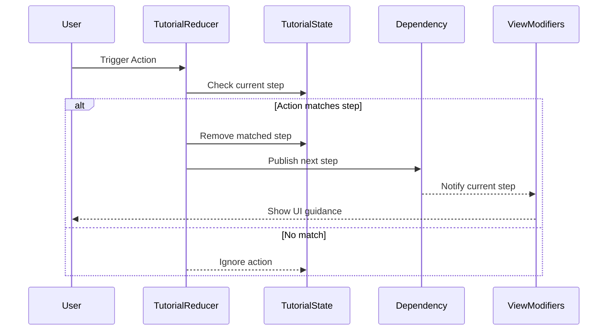
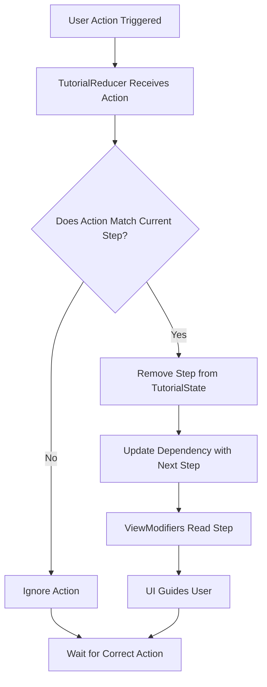

# Tutorial Reducer

Main Reducer: Reducer mean to portray to top layer of the feature. Not to be confused with the top Root Reducer that is top layer of the app. If a workout app that uses TCA has a camera feature to take photos, the top layer Reducer for the camera feature would be considered Main Reducer.

## What is it trying to solve? 

When building Modular apps, it becomes easier to add more features. As the features keep piling up, one starts to think of to teach the user of such features. TutorialReducer guides the user when an expected action is triggered. A UIKit-Popover will appear above or below with a tip in `AttributeString`. Insperation was taken from TipKit. 

## How does it work?

Quick refresher,  Reducers are meant to transmorm state and action by extracting a child state. User triggered actions will run on the respected Reducer and all previous reducers. Every action the Main Reducer obtains, children and gran-children of the Action, is eventaully the Main Reducer's Action. 
Example: Figure 1

```swift
@Reducer
struct CameraFeature {
  ...
  enum Action {
    case initialize
    case checkPermission
    case askuserPermission
    ...
    case camera(CameraFeatureAction)
  }
  ...
}
```

Figure 1: CameraFeature, who's a child of X-Feature Reducer

The reducer for CameraFeature's, converts all Actions from it's children, `CameraFeatureAction`, into `CameraFeature.Action`. Tutorial Reducer takes advantage of this to know which actions have been triggered. If the expected action is triggered TutorialReducer will move on to the next step that is required until no more steps are needed. 

## How will it use? 

Four components will be added:

- TutorialReducer
- TutorialState<Action>
- ViewModifiers
- Dependency to route the output




This system manages a step-based tutorial. The user interacts with the interface, triggering actions that are handled by the TutorialReducer. The reducer evaluates whether each incoming action matches the current expected step in the TutorialState<Action>. If the action corresponds to the correct step, the reducer removes that step and advances the tutorial by updating a shared Dependency.

The Dependency acts as a communication bridge, broadcasting state changes to ViewModifier Tutorial. These modifiers, in turn, update the UI dynamically to reflect the user’s progress through the tutorial and provide contextual guidance. If the user triggers an unexpected action, it is ignored and the tutorial state remains unchanged.

This architecture allows for decoupled state management, reactive UI updates, and scalable tutorial sequencing.

## Is it Modular?

Yes! The main Redcer of the feature should always hold onto TutorialState<Main.Action>. This is because all actions are one. I am an action, you are an action, we are all actions, inside action land. Is it possible to have the ChildReducer to have it's own TutorialReducer inside it's reducer builder. The tutorial will only trigger based on the actions store on the TutorialState<Action>.

## **Warning**

- If more than one state contains information for the tutorial state, unexpected pop overs may occur
- Because Pop-Over can be a first responder (UIKit-Landia), A tip may be missed if the App's View is in the middle of rendering between navigation transitions. In such cases, give the view time to finish the transition. Example: A sheet with all tutorials listed for the Main View. A button is triggered to dismiss the sheet AND to start a tutorial, the first tutorial may not appear.

## Flow Chart




